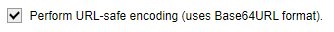

# Publishing mod on BYDLE Client

To release a modification for public use, you need to configure the mod so that BYDLE systems will recognize it. To do this, create a repository on [GitHub](https://github.com). You can set the license according to your needs.


Remember to set the visibility to **Public**, as BYDLE **requires all mods to be open-source** and the code to be accessible. Ensuring transparency not only meets BYDLE's standards but also fosters community collaboration and trust.


<figure><figcaption><p>Creating new repository on <a href="https://github.com">GitHub</a></p></figcaption></figure>

## Submitting Source Code to the Created Repository

Follow these steps to submit your source code to the repository:

#### **1. Clone the Repository**

Open your terminal (or command prompt) and navigate to the directory where you want to clone the repository.

Run the following command:

```bash
git clone <repository-url>
```

#### 2. Navigate to the Repository Directory

Change to the directory of the cloned repository:

```bash
cd <repository_name>
```

Replace `<repository-name>` with the name of your repository.

#### 3. Add your source code

* Copy your source code files into the repository directory.
* Ensure that you include all necessary files and folders.

#### 4. Stage the changes

Use the following command to stage the files for commit:

```bash
git add .
```

#### 5. Commit the changes

Commit the staged changes with a meaningful commit message:

```bash
git commit -m "Add initial source code"
```

#### 6. Push the Changes to the Repository

```bash
git push origin main
```

Ensure `main` is the correct branch you want to push to. Replace `main` with the appropriate branch name if different.


You can also use other tools, such as [GitHub Desktop](https://github.com/apps/desktop), to submit your source code to the repository.


## Creating first release

To create your first release, prepare a ZIP archive containing your mod files. Ensure that the highest-level directory in the ZIP file includes the mod’s `dll` file directly. **If you're mod is compatible with all DunHero versions, just don't tag the release.**

Ensure that the structure of the ZIP file is correct: the highest-level directory within the ZIP should contain the mod’s `dll` file directly. This structure is crucial as it ensures that users can easily access and install the mod without navigating through multiple subdirectories.

After preparing the ZIP file, navigate to the "Releases" section of your repository on the hosting platform. Here, you will draft a new release by selecting the option to "Draft a new release." In the release description, enter the [release tag](publishing-mod-on-bydle-client.md#how-to-create-encoded-version-tag) encoded in Base64URL format and provide a meaningful title for the release. You can also include additional details in the description field to give users context about what this release includes.

Next, upload the prepared ZIP file to the release. This ZIP file should contain your mod and adhere to the specified directory structure. Once the file is uploaded, review the release details to ensure everything is correct.

## How to create Encoded Version Tag

When creating version tags, you may need to encode them in Base64 URL format for compatibility with various systems or specifications. This guide will walk you through the process of creating and encoding a version tag, and how to properly format it.

#### 1. Prepare the Version Description

Start by defining the version description you want to encode. For example:

```rust
GameVersion -> 0.1.3
PreRelease -> true
```


[mod-version-description-language.md](mod-version-description-language.md)


**2. Encode the Description in Base64 URL**

Use a base64 encoder to convert the text. You can do this via a command-line tool, a script or an online tool like [base64encode.org](https://www.base64encode.org/). Make sure to check 

<details>

<summary>Using Command Line (Linux/macOS)</summary>

```bash
echo -n "GameVersion -> 0.1.3\nPreRelease -> true" | base64 | tr '+/' '-_' | tr -d '='
```

* `-n` ensures `echo` does not append a newline character.
* `base64` encodes the text in base64 format.
* `tr '+/' '-_'` replaces `+` and `/` with URL-safe characters `-` and `_`.
* `tr -d '='` removes padding characters (`=`) if desired.

</details>

<details>

<summary>Using Python</summary>

```python
import base64

text = "GameVersion -> 0.1.3\nPreRelease -> true"
encoded = base64.urlsafe_b64encode(text.encode()).decode().rstrip('=')
print(encoded)
```

Example output

```
R2FtZVZlcnNpb24gLT4gMC4xLjMKTW9yZSBHcmFuZCBjb3B5b3IuLg
```

</details>

#### 3. Include the Encoded Tag in release description

Insert the base64 URL encoded string between angle brackets (`<` and `>`) in your release description in the first line. For example:

```
<R2FtZVZlcnNpb24gLT4gMC4xLjM>
```

<div align="center">

<figure><figcaption></figcaption></figure>

</div>

## Publising mod on BYDLE Client

To submit your mod to the BYDLE client, you must use [**Google Form**](https://docs.google.com/forms/d/e/1FAIpQLScv9sUmGHGKLezghQbtBp2alSmCGvYtX8XtbSlTWgAM1zsZ5A/viewform?usp=sf\_link) to complete the submission process. Navigate to the provided Google Form link and ensure you fill out all the required fields with accurate information about your mod. This includes details such as the mod name, description, icons and any other relevant specifications. Providing complete and accurate information in the form is essential for a successful submission and proper integration of your mod into the BYDLE client.



Mod Submission Google Form

